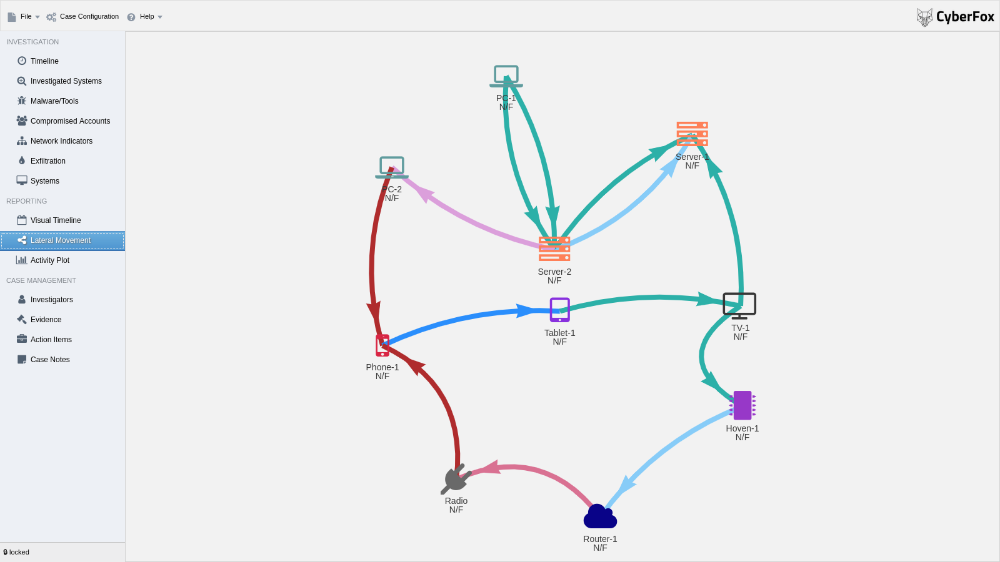
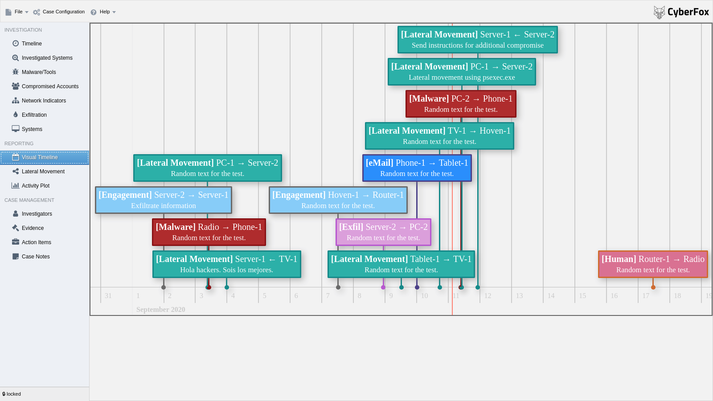

# Aurora Incident Response

Incident Response Documentation made easy. Developed by Incident Responders for Incident Responders.
Aurora brings "Spreadsheet of Doom" used in the SANS FOR508 class to the next level. Having led many cases and taught so many students how to do IR right, I realized, that many struggle
with keeping control over all the findings. That does not only prevent them from seeing what they already have, but even less so what they are missing. 

It's intended to be used in small and big incident response investigations to track findings, tasks, making reporting easy and generally stay on top of the game. The current version has been battle tested multiple times now. 
I'll keep fixing bugs and adding features as we go, but please remember, it's a leisure time project. So any help is appreciated.

Lateral Movement

Visual Timeline



## 1 Local installation

Aurora 0.7 is a local-first Vite browser application with no Electron runtime. Install Node.js 22.12 or newer and run:

```bash
cd Aurora-Incident-Response/src
npm ci
npm run build
npm run preview
```

Open the localhost URL printed by Vite. The production files are generated in `src/dist/` and can also be served by any static HTTP server on `localhost` or over HTTPS.

Here's a video on how to use Aurora:

[](http://www.youtube.com/watch?v=2j2XYcqQIm0 "")

## 2 Development

If you want to contribute, you are encouraged to do so. The application is written in JavaScript and HTML, with Vite providing the development server and production build.

### 2.1 Set up your development environment

Install Node.js 22.12 or newer, then install the project dependencies:

```bash
git clone https://github.com/cyb3rfox/Aurora-Incident-Response
cd Aurora-Incident-Response/src
npm ci
```

Start Vite with hot reload:

```bash
npm run dev
```

Open `http://127.0.0.1:5173/` in your browser.

### 2.2 Roadmap

The following points are already on the roadmap. Please just post a new issue or send a message on [Twitter](https://twitter.com/cyberfox) if you got any suggestions for new improvements.

You can checkout the planned feature for the nex releases under [projects](https://github.com/cyb3rfox/Aurora-Incident-Response/projects).

### 2.3 Build for local deployment

Create the static production application:

```bash
npm run build
```

Preview that build locally:

```bash
npm run preview
```

The deployable output is `src/dist/`. Serve it from `localhost` or HTTPS; opening `dist/index.html` directly with a `file://` URL will not provide the secure browser context required for writable local-file handles.

Run the storage-adapter tests, syntax checks, and production build with:

```bash
npm test
npm run check
```

#### Local-file autosaving

For in-place autosaving, use a current Chrome or Edge browser. Choose **File → Open SOD** to open an existing `.fox` file, or **File → Save SOD** to select a file for a new case. After write permission is granted, Aurora writes back to that file every five minutes and when the page is backgrounded.

Browsers without writable file-handle support remain usable, but Save creates a downloaded `.fox` copy instead of overwriting the original. Keep the Aurora tab open while working; browser permissions and the selected handle belong to that tab. Use **Release Lock** before closing a shared case because browsers cannot guarantee an asynchronous unlock write while a tab is closing.

### 2.4 Sourcecode Navigator

This section describes the various sourcecode files. For now I need to keep this section small. I tried to comment in the code as good as I can. If you got any questions, just ping me. If you want to join me developing the tool, there's a slack channel to communicate. Drop me a note and I will invite you.

#### 2.4.1 `index.html` and `renderer.mjs`

`index.html` is the Vite entry point. `renderer.mjs` loads the existing browser libraries and Aurora modules in their required order, installs best-effort background saving, and initializes the GUI.

#### 2.4.2 `browser-storage.mjs`

The browser storage adapter implements `.fox` and CSV open/save operations. It uses writable local file handles when the browser supports them and download/upload fallbacks otherwise.
 
#### 2.4.3 `gui_definitions.js`

I tried as good as I can to separate code an design. This file holds all the definition json for the `w2ui` GUI. There is some code left in there
for the renderers that format certain columns. It didn't make sense to place them anywhere else.
 
#### 2.4.4 `controller.js`

The controller injects the handling functions for gui events. So whenever a button is pressed, or any other event needed happens, controller.js handles what happens.
 
#### 2.4.5 `gui_functions.js`

Every now and then operations happen that change something in the GUI. That could e. g. be making all the datafields readonly when you don't have the lock or simply opening a popup.
All these functions are located in this file which is a plain JSON file.
  
#### 2.4.6 `data.js`

While the actual data is stored in the `w2ui` datasctructures, for saving and some other operations we need to bring it into out format. 
Transformations like this and all logic regarding saving and opening files is located here.
 
#### 2.4.7 `data_template.js`
  
This holds templates for the internal data format of that version. Current format version is 7.
 
#### 2.4.8 `misp.js`
 
Code for MISP integration.
 
#### 2.4.9 `virustotal.js`
  
Code for VT integration.
 
#### 2.4.10 `settings.js`
 
Settings for different libraries. Currently only defines the time field format for `w2ui`.
 
#### 2.4.11 `helper_functions.js`

Small helper functions that do not fit anywhere else.

#### 2.4.12 `import.js`

Handles CSV imports

#### 2.4.13 `exports.js`

Handles CSV exports

## 3 Licensing

Aurora is licensed under the Apache 2 License.

## 4 Credits
Projects like this can only be realized because many people invested thousands of hours into writing cool libraries and other software. Others contribute professional UI items. Thank you for all your great work. Namely I build Aurora based on the following dependencies:

* Vite https://vite.dev
* jquery https://jquery.com
* w2ui http://w2ui.com/web/
* vis.js https://visjs.org
* icons8 https://icons8.com
* Fontawsome https://fontawesome.com

Besides the incredible amount of work that people invested into these projects, you need other support as well. Writing the code is easy, but making it a tool the works in reality depends on a vast amount of experience from many incident responders. 
Here I particularly want to mention the members of my IR team who contributed their knowledge and helped testing the tool in real world cases:

* Rothi
* Bruno
* Sandro

Even though this is a side and weekend project it's still good to know, that my employer Infoguard AG supports me in any way they can. Thank you particularly to:

* Ernesto
* Thomas

The following people have contributed changes that have a significant impact on the tool:

* Félix Brezo, Ph. D. (working on visualization parts)

Full Vite conversion:
* Marcus